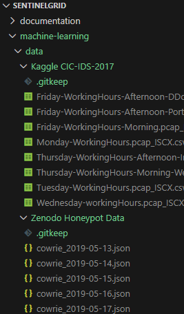

# Data
This directory contains instructions for obtaining all datasets used in the machine learning and threat analysis pipeline for Sentinel Grid as well as outputs from the pipelines and analyzation.

⚠️ Datasets are not stored in this repository due to large file size.
Please download them manually and place them in the correct folders as described below.

.gitkeep files are stored under each data folder just for the purpose of keeping the folder structure

Here’s an overview of the data folder structure:

  

## Kaggle Network Intrusion Dataset
This project uses the **Network Intrusion Dataset** available on Kaggle for the protyping step of this project. This is good for providing a human baseline modeling since it contains both BENIGN and ATTACK labels. Only issue is that since there are no real human SSH command level SSH and password strings due to sensitive information, so this is just a rough test baseline. We could later down the line compute entropy from legitimate test logins with no password storage to account for security issues or generate them oursleves.

Dataset link:  
https://www.kaggle.com/datasets/chethuhn/network-intrusion-dataset  

Download from the link above and add in the `machine-learning -> data -> Kaggle CIC-IDS-2017` folder

## Zenodo Honeypot Data

This project uses the **Zenodo CyberLab Honeynet Dataset** for the protyping and training step of this project. This will allow our model to be more accurate when dealing with our own collected data. We can use this data specifically for atttacker modeling to learn attacker patterns and behaviors.
There are many json files for different days of data. We can use many of them for training and validation purposes, but for the initial stage, I will use 5 days of data:

- cyberlab_2019-05-13.json.gz
- cyberlab_2019-05-14.json.gz 
- cyberlab_2019-05-15.json.gz
- cyberlab_2019-05-16.json.gz
- cyberlab_2019-05-17.json.gz 

Dataset link:  
https://zenodo.org/records/3687527

Download from the link above and add in the `machine-learning-> data -> Zenodo Honeypot Data` folder

## Cowrie Logs
The `cowrielogs` folder will contain the JSON files from the collected data from our honeypots and the `outputs` folder will contain:
- `cowrie_events.csv`
- `cowrie_features.csv`
- `cowrie_sessions.csv`
- `clustered_sessions.csv`
- `anomaly_scores.csv`
- `behavior_summary.json` 

files created from the honeypot data processing, feature extraction, anomaly clustering, and behavior analysis.

In order to test our pipeline before the collection of our honeypot data, I used 107 synthetic data logs in `cowrieTEST.json` which contains a couple sample logs from Cowrie plus ChatGPT generated example data. Using this data, I was able to test the pipeline in `01_honeypot_pipeline.ipynb` and `02_behavior_model.ipynb` and produce the outputs in `TESToutputs` folder. 

Once we collect enough logs to have a full dataset, I will be able to re-test the pipeline to make sure all the cases are covered.
